<div align="center">

# 🔍 MID: Mobile Information Detective
### *Phone ka CID*

<a href="https://devfolio.co/">
  
</a>
<a href="#-our-solution-mid-system">
  
</a>
<a href="#-tech-stack">
  
</a>

**A real-time digital guardian that verifies content as you browse, protecting you from fake news, phishing, and scams.**

[🎥 Watch the Demo](#-project-demo) • [🎯 Our Mission](#-our-mission) • [🏗️ How It Works](#-how-it-works) • [🚀 Get Started](#-quick-start)

---

</div>

## 🏆 MumbaiHacks 2025 Submission

> [!IMPORTANT]  
> **This project is a submission for the MumbaiHacks 2025 Hackathon.**
> - **Track:** Misinformation
> - **Theme:** Agentic AI
> - **Problem Statement:** We are tackling the "Bring your own problem" statement by addressing the surge of digital misinformation during global and local crises.

## 🎥 Project Demo

<div align="center">

*Watch our full 1-minute video demonstrating MID's intro, live simulation, and outro.*

<a href="https://youtu.be/-xtTK0K-Rbc?si=0JiC4JhXlkOmTbAS" target="_blank">
  
</a>

<a href="https://youtu.be/-xtTK0K-Rbc?si=0JiC4JhXlkOmTbAS" target="_blank"><strong>📺 Click Here to Watch the Full Demo on YouTube</strong></a>

</div>

---

## 🎯 Our Mission

> [!NOTE]  
> In a world of endless scrolling and information overload, how do you know what to trust?

MID is an **AI agent** designed to act as your real-time digital detective. It seamlessly integrates with your mobile experience, instantly scanning and verifying content across all your apps. Our mission is to empower users to navigate the digital world with confidence, making misinformation a problem of the past.

---

## ✨ Our Solution: MID System

MID is a two-part system designed for maximum power with minimal impact on your phone's performance.

> [!TIP]
> By offloading heavy AI processing to a connected PC or future cloud server, MID keeps your mobile device fast and responsive while delivering powerful, real-time analysis.

<div align="center">

### 🎨 Visual Verification Overlays

<table>
<thead>
  <tr>
    <th width="33%" align="center">✅ Verified Content</th>
    <th width="33%" align="center">⚠️ Potentially Misleading</th>
    <th width="33%" align="center">🚨 Fake News / Scam</th>
  </tr>
</thead>
<tbody>
  <tr>
    <td align="center">A green highlight confirms the information is legitimate and cross-verified with trusted sources.</td>
    <td align="center">An amber highlight warns that the content is unverified or contains mixed signals. Proceed with caution.</td>
    <td align="center">A red highlight alerts you to known misinformation, phishing links, or scam attempts.</td>
  </tr>
</tbody>
</table>

</div>

---

## 🏗️ How It Works

The MID system is an Agentic AI pipeline that captures, analyzes, and delivers a verdict in milliseconds.

```mermaid
graph TD
    A[📱 Mobile App: Content Capture] -->|Encrypted Snippet| B(🖥️ PC Backend);
    B --> C{🧠 Agentic AI Core};
    C -->|Analyze Text/Image| D[🤖 ML Models];
    C -->|Cross-Reference| E[📚 Knowledge Base];
    D --> F[⚖️ Decision Engine];
    E --> F;
    F -->|Instant Verdict| A;
    A --> G[🎯 Renders Visual Overlay];
```

<details>
<summary><b>Click to Expand System Architecture</b></summary>


</details>

---

## 🛠️ Tech Stack

<div align="center">

| Mobile (Frontend) | Backend (AI Agent) | Infrastructure |
| :---: | :---: | :---: |
|  |  |  |
|  |  |  |
|  |  |  |

</div>

---

## 🚀 Quick Start

> [!WARNING]  
> This is a hackathon prototype. The PC server must be running on the same local network for the mobile app to connect.

### 📋 Prerequisites
- **Mobile:** Android Device with Developer Mode enabled.
- **PC:** Python 3.9+, Docker, and Docker Compose.

### ⚡ Installation & Setup

```bash
# 1. Clone the repository
git clone https://github.com/MarvelBoy047/mid.git
cd mid
```
# 🚧Under Development🚧
---
### ⭐ Star This Project If You Believe in a Safer Digital World!
